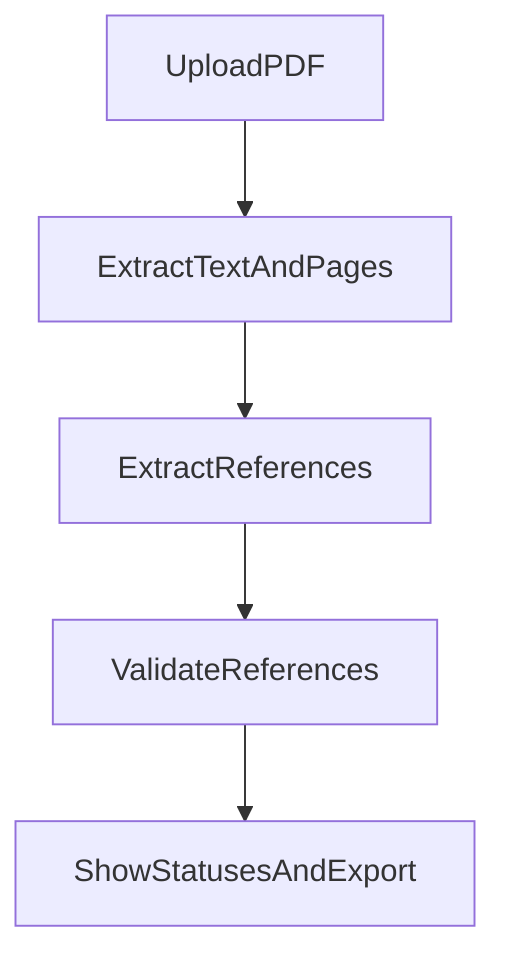
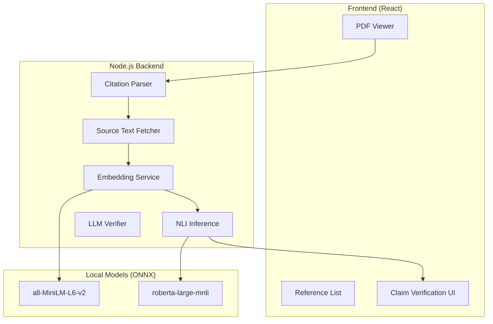

# RefChecker - Academic Reference Validator

RefChecker is a desktop/web application that streamlines academic manuscript review by automatically extracting and verifying citations from PDF papers. The app helps researchers identify missing references, incorrect citations, and metadata discrepancies by cross-referencing extracted references against authoritative academic databases.

## Features

### Core Functionality
- **PDF Upload & Processing**: Upload academic papers and automatically extract references
- **Dual-Pane Interface**: View references on the left, PDF preview on the right
- **Reference Extraction**:
  - **Default**: GROBID-based bibliography extraction (requires a local GROBID service)
  - **Optional**: LLM-based extraction (if enabled in settings)
  - The legacy regex extractor remains in the codebase but is no longer used
- **Multi-Source Validation**: Cross-references against CrossRef, Semantic Scholar, OpenAlex, and ArXiv
- **Status Indicators**: Visual feedback showing verified, warning, error, or unverified references
- **Export Options**: Export results as JSON or CSV

## How the app works (high-level)

RefChecker has three main stages:

1. **PDF ingestion & text extraction**
   - You upload a PDF in the UI.
   - The app extracts text and page boundaries so it can display the PDF and navigate.
2. **Reference extraction**
   - Extract references from the bibliography/references section using **GROBID** (default) or an **LLM** (optional).
3. **Reference validation**
   - Validate each extracted reference against academic databases (CrossRef, Semantic Scholar, OpenAlex, arXiv).
   - Optionally run an **agent-based** workflow to improve recall and provide better “why it failed” explanations.



### Validation Sources
1. **CrossRef API** - Best for DOI resolution and metadata
2. **Semantic Scholar API** - Good coverage of CS/ML papers
3. **OpenAlex API** - Open database, reliable fallback
4. **ArXiv API** - For papers with ArXiv IDs

### Optional LLM Integration
Configure API keys in settings to use LLM-enhanced extraction:
- OpenAI
- Anthropic
- Google Gemini

## Validation modes (API-only vs agent-based)

RefChecker supports two validation modes:

- **API-only mode** (default)
  - Runs enabled validators sequentially (to respect rate limits).
  - Sources are compared using similarity thresholds:
    - Title similarity threshold: **0.70**
    - Author overlap threshold: **0.60**
    - Year tolerance: **±1 year**
- **Agent-based mode**
  - Runs a multi-step workflow to increase match rates and produce a helpful explanation when a reference can’t be found.

### Agent-based workflow

The agent-based validation is implemented in:
- `src/services/validation/agentValidationOrchestrator.ts`
- `src/services/validation/agents/*`

It runs these steps in order:

1. **API Agent** (`agents/apiAgent.ts`)
   - Runs all enabled API validators in **parallel**.
   - If any match is strong enough (score > ~0.7), it can stop early.
2. **Query Enhancement Agent** (`agents/queryEnhancementAgent.ts`)
   - Uses an LLM to generate multiple “better search query” variants (title/author/year normalization, abbreviation expansion, punctuation removal, etc.).
   - Retries the API validators with these enhanced queries.
3. **Web Search Agent** (`agents/webSearchAgent.ts`)
   - Uses **Perplexity** (model `sonar-pro`) to search the web and extract structured reference metadata.
   - Requires `PERPLEXITY_API_KEY` in your server `.env` file (API key is kept server-side for security).
4. **Explanation Agent** (`agents/explanationAgent.ts`)
   - If the reference still can’t be confirmed, generates a short explanation of what was tried and suggestions for manual verification.
   - Uses your preferred LLM if configured, otherwise uses a built-in fallback explanation.

## Getting Started

### Prerequisites
- Node.js 18+
- npm or yarn
- Docker Desktop (for running the local GROBID service)

### Installation

```bash
# Install dependencies
npm install

# Start Vite dev server only
npm run dev

# Start the Node proxy only (used to talk to GROBID)
npm run dev:proxy

# Start both Vite + proxy together (recommended)
npm run dev:all

# Build for production
npm run build
```

## Running GROBID locally (required when LLM extraction is disabled)

This app uses **GROBID** to extract bibliography references from PDFs. GROBID runs as a local service on port `8070`, and the app talks to it through a small local Node proxy (port `5174`).

### 1) Start Docker Desktop
Open Docker Desktop and make sure the Docker engine is running.

### 2) Start the GROBID container

```bash
docker run -t --rm -p 8070:8070 lfoppiano/grobid:0.8.2
```

Then confirm GROBID is responding:

```bash
curl -I http://localhost:8070/
```

### 3) Start the app + proxy

```bash
npm run dev:all
```

Open the app at `http://localhost:5173`.

## Extraction behavior (LLM vs GROBID)

- If **LLM extraction is enabled** in Settings and a PDF file is available:
  - The app uses the LLM first.
  - If the LLM returns no references or errors, it falls back to **GROBID**.
- If **LLM extraction is disabled**:
  - The app uses **GROBID by default**.
  - Regex extraction is not used.

### Local proxy details

- Vite dev server proxies requests from `/api/*` to the local Node proxy at `http://localhost:5174`.
- The Node proxy forwards the PDF to GROBID:
  - `POST http://localhost:8070/api/processReferences`
  - Includes `includeRawCitations=1` so raw reference strings are available when possible.

### Usage

1. **Upload a PDF**: Drag and drop or click to upload an academic paper
2. **Review Extracted References**: References appear in the left panel with status indicators
3. **Validate**: Click "Validate All" to verify references against academic databases
4. **Navigate**: Click any reference to jump to its location in the PDF
5. **Export**: Download results as JSON or CSV for further analysis

### Settings

Access settings via the gear icon to configure:
- API keys for LLM providers
- Extraction method (GROBID default or LLM)
- Validation sources to use
- Rate limiting delays
- Validation mode (API-only or agent-based)

## Environment variables

The app can run without any API keys, but some optional features require them.

- **Server-side (in `.env` file)**:
  - `PERPLEXITY_API_KEY` - For web search in agent-based validation mode
  - `PORT` - API proxy port (default: 5174)
  - `GROBID_URL` - GROBID service URL (default: http://localhost:8070)
- **Client-side (configured in Settings UI)**:
  - Semantic Scholar API key (optional, for higher rate limits)
  - OpenAI / Anthropic / Gemini keys (for LLM-based extraction)

See `.env.example` for a complete template.

## Troubleshooting

### Docker / GROBID issues

- **`Cannot connect to the Docker daemon ... docker.sock`**
  - Docker Desktop isn’t running yet. Open Docker Desktop and wait for the engine to start.

- **`Bind for 0.0.0.0:8070 failed: port is already allocated`**
  - Something is already using port `8070` (often an existing GROBID container).
  - Check running containers:

```bash
docker ps
```

  - Stop the conflicting container:

```bash
docker stop <container_id>
```

### Proxy issues

- **Proxy works but extraction returns `{"error":"fetch failed"}`**
  - GROBID likely isn’t running or isn’t reachable at `http://localhost:8070`.
  - Check:

```bash
curl -I http://localhost:8070/
```

## Tech Stack

- **Framework**: React with TypeScript
- **Build Tool**: Vite
- **PDF Rendering**: react-pdf (pdf.js)
- **State Management**: Zustand
- **Styling**: Tailwind CSS v4
- **Icons**: Lucide React
- **Local services**:
  - GROBID (Docker)
  - Node proxy (Express + multer + fast-xml-parser)

## Color Scheme

- **Primary Background**: `#0a0a0a` (near black)
- **Secondary Background**: `#1a1a2e` (dark blue-black)
- **Accent**: `#4fc3f7` (light blue)
- **Success**: `#4caf50` (green)
- **Warning**: `#ff9800` (orange)
- **Error**: `#f44336` (red)

## Project Structure

```
server/
└── index.ts               # Local Node proxy for GROBID

src/
├── components/
│   ├── Layout/           # Header, FileUpload, SplitPane
│   ├── PDFViewer/        # PDF rendering and navigation
│   ├── ReferenceList/    # Reference display and status
│   └── Settings/         # API key and settings management
├── services/
│   ├── pdf/              # PDF extraction and bibliography detection
│   ├── extraction/       # GROBID client, LLM extractor, legacy regex extractor
│   ├── validation/       # CrossRef, Semantic Scholar, OpenAlex, ArXiv
│   └── utils/            # String matching, author normalization, DOI parsing
├── store/                # Zustand state management
├── types/                # TypeScript type definitions
└── App.tsx               # Main application component
```

## API Notes

- **CrossRef**: No API key required, uses polite pool
- **Semantic Scholar**: Free tier available, API key optional for higher limits
- **OpenAlex**: Free, no key required
- **ArXiv**: Free, rate limit 1 request/3 seconds

## Security

See [SECURITY.md](./SECURITY.md) for security practices, deployment recommendations, and vulnerability reporting.

---

## Roadmap / Future Plans

### 🚧 Claim Verification System (Planned)

A comprehensive claim verification feature is planned that will allow users to verify whether in-text citations actually support the claims being made. This system will analyze the relationship between what an author claims and what the cited source actually says.

#### Planned Architecture



#### Planned Features

| Feature | Description | Status |
|---------|-------------|--------|
| **Citation Extraction** | Extract in-text citations with surrounding context | 🔲 Planned |
| **Regex Parser** | Fast extraction using regex patterns (`[1]`, `(Author, 2023)`, etc.) | 🔲 Planned |
| **LLM Parser** | More accurate extraction using OpenAI/Anthropic/Gemini | 🔲 Planned |
| **Source Text Fetching** | Retrieve abstracts from CrossRef, arXiv, Semantic Scholar, Unpaywall | 🔲 Planned |
| **Sentence Embeddings** | Local embeddings using all-MiniLM-L6-v2 (ONNX) | 🔲 Planned |
| **NLI Verification** | Natural Language Inference using roberta-large-mnli | 🔲 Planned |
| **LLM Verification** | Alternative verification using user's LLM API keys | 🔲 Planned |
| **Verdict System** | Multi-level verdicts (strongly supported → contradicted) | 🔲 Planned |
| **PDF Claim Highlighting** | Visual highlighting of claims in PDF (distinct from references) | 🔲 Planned |
| **Collapsible PDF Panel** | Full-width reference list with collapsible PDF | 🔲 Planned |

#### Planned Verdict Types

The claim verification system will produce nuanced verdicts:

- 🟢 **Strongly Supported** - High similarity + entailment from source
- 🟢 **Supported** - Good similarity + entailment
- 🟡 **Weakly Supported** - Moderate similarity + neutral/entailment
- 🟡 **Related but Insufficient** - Similar sentences but neutral NLI
- 🟠 **Likely Contradicted** - Weak contradiction signal
- 🔴 **Contradicted** - Clear contradiction found
- ⚪ **Weakly Related** - Low similarity, no strong signal
- ⚪ **Not Found** - No relevant sentences found in source

#### Verification Methods

Users will be able to choose between:

1. **NLI Model (Local)** - Free after model download, runs locally using ONNX
2. **LLM (API)** - Uses configured API keys, provides explanations
3. **Both** - NLI first, then LLM for confirmation on borderline cases

#### New Settings (Planned)

```typescript
interface ClaimVerificationSettings {
  enabled: boolean;
  citationExtractionMethod: 'regex' | 'llm';
  verificationMethod: 'nli' | 'llm' | 'both';
  topK: number;              // Evidence sentences to consider
  similarityThreshold: number;
}
```

### Other Future Enhancements

- **Batch Processing** - Process multiple PDFs at once
- **Citation Graph Visualization** - Visualize citation relationships
- **Browser Extension** - Quick reference checking from any webpage
- **Collaborative Annotations** - Share verification results with team
- **Custom Validation Rules** - Define project-specific validation criteria

---

## Contributing

Contributions are welcome! Please see the roadmap above for planned features that could use help.

1. Fork the repository
2. Create a feature branch (`git checkout -b feature/amazing-feature`)
3. Commit your changes (`git commit -m 'Add amazing feature'`)
4. Push to the branch (`git push origin feature/amazing-feature`)
5. Open a Pull Request

## License

MIT
